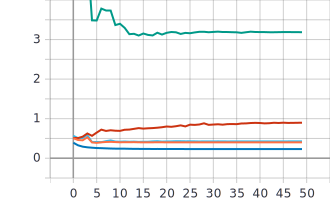

Лабораторная работа 3.  
====
# Немного информации о цели лабараторной работы
Обучить нейронную сеть с использованием техники обучения Transfer Learning. В данной работе использовалась нейронная сеть EfficientNet-B0.Данная неронная сеть уже предобученна  на базе изображений ImageNet, так как техника Transfer Learning предполагает использование предварительно обученной нейронной сети. В первой части работы использовался фиксированный темп обучения (0.1, 0.01, 0.001, 0.0001). Во второй части работы использовались следующие политики изменения темпа обучения: пошаговое затухание и экспоненциальное затухание.

# 2.С использованием техники обучения Transfer Learning обучить нейронную сеть EfficientNet-B0 (предварительно обученную на базе изображений imagenet) для решения задачи классификации изображений Oregon WildLife с использованием фиксированных темпов обучения 0.1, 0.01, 0.001, 0.0001 
 
* Изменение темпов обучения от 0.1 до 0.0001
```
#optimizer=tf.optimizers.Adam(lr=0.1)
#optimizer=tf.optimizers.Adam(lr=0.01)
#optimizer=tf.optimizers.Adam(lr=0.001)
#optimizer=tf.optimizers.Adam(lr=0.0001)
```


 ### Графики обучения для предобученной нейронной сети EfficientNet-B0 с фиксированным темпом обучения 0.1, 0.01, 0.001, 0.0001:
  
 ***График метрики точности:*** 


 ***График функции потерь:*** 
 


 ***Пояснение:*** 


### Анализ результатов:
Смотря на график метрики точности видно, что лучшее значения, достигаются при использовании темпов обучения 0.001, равное 87.92%, и 0.1, равное 87.32% . Смотря на график функции потерь видно, что минимальные потери были при темпах обучения 0.001 и 0.0001. Исходя из данных результатов можно сказать, что темп обучения 0.001 является оптимальным.


# Реализовать и применить в обучении следующие политики изменения темпаобучения, а также определить оптимальные параметры для каждой политики: Пошаговое затухание (Step Decay) и Экспоненциальное затухание (Exponential Decay)

* **Описание структуры** 


* Функция пошагового затухания, где initial_lrate = 0.0001 - начальный темп обучения,  drop = 0.25 - изменения темпа обучения, в моем случае в 4 раза, epochs_drop = 5.0 - каждый 5 эпох будет изменять темп обучения.
```
def step_decay(epoch,layer):
  initial_lrate = 0.01
  drop = 0.25
  epochs_drop = 5.0
  lrate = initial_lrate * math.pow(drop,math.floor((1+epoch)/epochs_drop))
  return lrate
```


* Функция экспоненциального затухания, где initial_lrate = 0.001 - начальный темп обучения,  k = 0.1 - коэффициент 
```
def exp_decay(epoch,lr):
  initial_lrate = 0.01
  k = 0.5
  lrate = initial_lrate * math.exp(-k*epoch)
  return lrate
```


 ### Графики обучения для предобученной нейронной сети EfficientNet-B0 с политикой изменения темпа обучения - пошаговое затухание
 

 ***График метрики точности:*** 


 ***График функции потерь::*** 
 


 ***Пояснение:*** 


### Анализ результатов:
Смотря на график метрики точности и функции потерь видно, что лучшее значения, достигаются при использовании параметров initial_lrate = 0.001, drop = 0.5, epochs_drop = 5.0. Получилось значение точности равное 88.52%, что на 0.60% лучше, чем при фиксированном темпе обучение. Также при данных параметрах достигается наилучшее значение функции потерь равное 0.2313.

 ### Графики обучения для предобученной нейронной сети EfficientNet-B0 с политикой изменения темпа обучения - экспоненциальное затухание
 

 ***График метрики точности:*** 


 ***График функции потерь::*** 
 


 ***Пояснение:*** 


### Анализ результатов:
Смотря на график метрики точности и функции потерь видно, что лучшее значения, достигаются при использовании параметров initial_lrate = 0.1 и k = 0.3. Получилось значение точности равное 89.07%, что на 1.75% лучше, чем при фиксированном темпе обучение. 


 ### Итоговое сравнение оптимальных результатов
 

***График метрики точности:*** 


 ***График функции потерь::*** 
 


 ***Пояснение:*** 


### Анализ результатов:
Смотря на график метрики точности и функции потерь видно, что лучшее значения, достигаются при использовании параметров initial_lrate = 0.1 и k = 0.3. Получилось значение точности равное 89.07%, что на 1.75% лучше, чем при фиксированном темпе обучение. 
